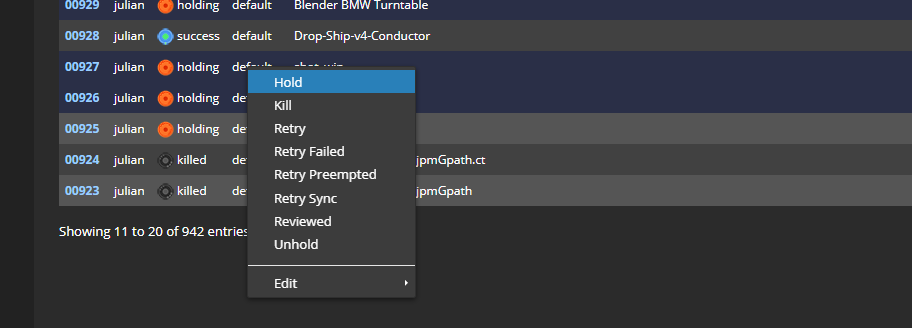

# Managing Your Jobs

Jobs can be managed via the (web dashboard | https://dashboard.conductortech.com)

Each row on the job's page represents a submission.

## The Job Page

JOB ID
:   Every job in your account is given a unique ID.  
 

USER
:   The user that submitted the job.  
 

STATUS
:   The current status of the job.

<table>
  <tr>
    <td> pending </td>
    <td> A pending status is reported as the job is being submitted to the cloud, dependencies are being uploaded or machine instances are being initiated. </td>
  </tr>
  <tr>
    <td> success </td>
    <td> All tasks have successfully completed.</td>
  </tr>
   <tr>
    <td> downloaded </td>
    <td> All successfful tasks have been downloaded. </td>
  </tr>
  <tr>
    <td> failed </td>
    <td> At least one task has failed.</td>
  </tr>
  <tr>
    <td> preempted </td>
    <td> At least one task was preempted.</td>
  </tr>
  <tr>
    <td> holding </td>
    <td> The job was placed on hold. This can be done manually or while waiting for the scout frames to successfully complete.</td>
  </tr>      
</table> 

PROJECT
:   The project that the job was submitted under.  
 

TITLE
:   The title given to the Job  
   

PRIORITY
:   A higher number will run before a lower number  
 

CORES
:   The number of cores on the render node selected for the job  
 

MEMORY
:   The amount of memory on the render node selected for the job  
 

PREEMPTIBLE
:   Whether the render node is preemptible.  
 

PROGRESS
:   Shows a summary of the status of all the tasks
   
<!--
    Blue: Tasks that have successfully completed
    Orange: Tasks that are holding
    Black: Tasks that started and killed
    Dark/Light Gray: Tasks haven't started
    Red: Tasks  that have failed
    Yellow: Job is waiting to start (pending or syncing) -->

TASKS
:   The number of tasks inside the job.  
   

AVG. FRAME
:   The average time it took for each task to complete.  
 

CREATED
:   The time the job was submitted/created.  

## Controlling Your Jobs
Once a job has been submitted it can be modified and controlled via the Web Dashboard.

Jobs can be selected by clicking on the row. Multiple rows can be selected using standard ctrl (command on OSX) and shift techniques. 

Right-clicking on the selected rows will bring-up the context menu that has the following options:

<table>
  <tr>
    <td> Hold </td>
    <td> Hold the job. All tasks will be in a holding state. </td>
  </tr>
  <tr>  
    <td> Kill </td>
    <td> Kill the job. All tasks will be stopped immidiately. </td>
  </tr>
  <tr>
    <td> Retry </td>
    <td> Retry the job. All tasks will be retried. </td>
  </tr>
  <tr>
    <td> Retry Failed </td>
    <td> Only retry Tasks that have failed. </td>
  </tr>
  <tr>  
    <td> Retry Preempted </td>
    <td> Only retry Tasks that have been preempted. </td>
  </tr>
  <tr>  
    <td> Retry Sync </td>
    <td> Retry the job sync </td>
  </tr>
  <tr>
    <td> Reviewed </td>
    <td> Mark a job as being reviewed.</td>
  </tr>
  <tr>  
    <td> Unhold </td>
    <td> Unhold the job. All tasks will revert to the state they were in before being held. </td>
  </tr>
  <tr>
    <td> Edit / Instance Type </td>
    <td> Change the type of render node the job will run on. Only affects Tasks that have not yet run.</td>
  </tr>        
  <tr>
    <td> Edit / Priority </td>
    <td> Change the priority of the job.</td>
  </tr>  
</table>

