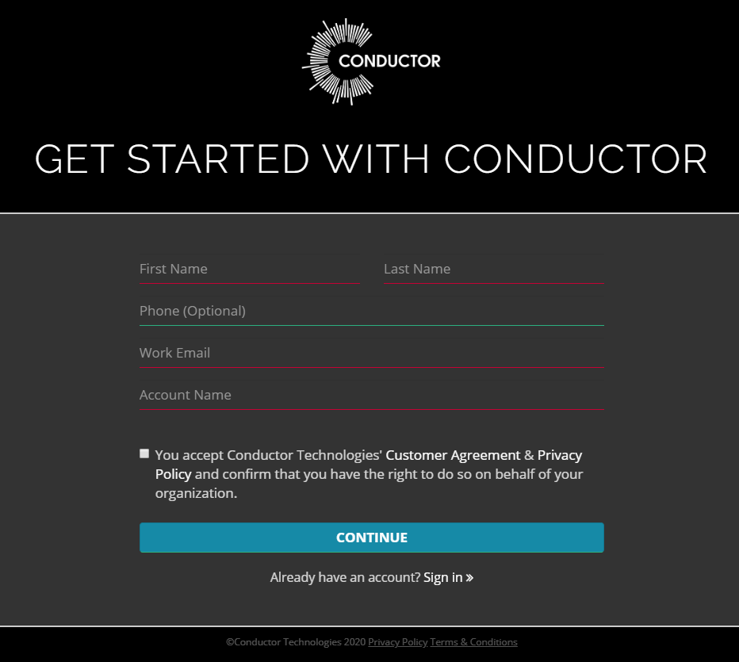

# Overview

Getting your first job running in Conductor is simple and straightforward. Use this guide to get up and running. These are the necessary steps to see your first Conductor rendered images:

  1. Setup your account
  2. Install the Client Tools
  3. Submit your first job (and upload all the necessary files)
  4. Follow the progress of your job
  5. Download the results

## Setting up an Account

To start using Conductor, head over to https://www.conductortech.com and click on the Get Started button in the top-right corner.

!!!note
    Accounts can have multiple users. If you're part of an organization that already has an account, ask your administrator to add you as a user to the existing account.

!!!tip
    The account name should be generic as it can be reused for multiple projects. Once the account is created, the name *can not* be changed.

Fill in your personal details, accept the terms and conditions and you will recieve a confirmation email. After confirming your email you will be prompted for a password.

You will then recieve a second email with instructions on downloading and getting started (pointing you to this page).

## Installing

Latest version: <iframe class="current-version" src="https://downloads.conductortech.com/companion/current-version.txt"></iframe>

Download and run an installer from the list below.

|Operating system| Download link |
|:------------|:-------------|
|Mac (OSX)|  [conductor-latest.pkg](https://downloads.conductortech.com/companion/conductor-latest.pkg) |
|Windows 10|   [conductor-latest.exe](https://downloads.conductortech.com/companion/conductor-latest.exe) |
|Centos 7.x|  [conductor-latest-0.el7.x86_64.rpm](https://downloads.conductortech.com/companion/conductor-latest-0.el7.x86_64.rpm) |

The Client Tools are a collection of DCC plugins and stand-alone applications for submitting and managing Conductor jobs.

They include:

  * [Maya plugin](/client_tools/maya.md) (supports Arnold, Renderman, or VRay)
  * [Nuke plugin](/client_tools/nuke.md)
  * [Clarisse plugin](/client_tools/clarisse.md)
  * [Conductor Companion app](/client_tools/companion/overview.md) (for downloading files and submitting other types of jobs)

!!!note
    Is there no plugin for your favorite DCC? No problem! That's what the Conductor Companion app is for.
