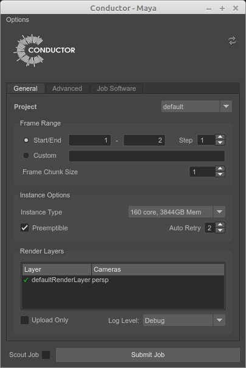

# Submitting Jobs

There are two imporant parts to getting your job to run on Conductor:

  * Setting the parameters for your job
  * Uploading all the necessary files

This section will walk through the general process of submitting a job, using the Maya submitter plugin as an example. For details on submitting a job from a particular DCC or from the Companion app, see the following:

  * [Maya plugin](/client_tools/maya.md)
  * [Nuke plugin](/client_tools/n*uke.md)
  * [Clarisse plugin](/client_tools/clarisse.md)
  * [Conductor Companion app](/client_tools/companion/overview.md)

## Job Parameters

Open the submitter. The first time you open the submitter, the Conductor login page will open in your browser window. This is where you'll authenticate. Enter the email and password you entered when first signing-up. This only has to be done once on each computer you use

Next, set all the parameters. Most of the default values should be correct. For details on what each parameter does, see the documentation for the appropriate plugin.

You'll want to ensure that Scout Job is checked. This will hold all your frames until your scout frames have succesfully completed. You'll be able to specify your scout frames in the next step.

!!!note
    If you have long running frames and want to be notified by email once the job is complete, you can enter notification email(s) in the Advanced Tab

When you're ready, click on the Submit Job button and you'll be prompted to enter a comma-separated list of scout frames.

After you enter the scout frames and click Ok, Conductor will scrape your scene for the all the dependent files and start the upload the process. Once the upload process has completed, you'll recieve a confirmation dialog with your job number. Clicking on the job number will open up the Web Dashboard in your browser.

!!!note
    Conductor keeps a cache of all the files you've uploaded. Submitting a scene a second time is always a lot faster (you'll only have to upload anything that's changed). Conductor's cache is based on the contents of a file, not the name. If you rename or change a file's location, it won't be necessary to upload it a second time.

!!!tip
    The Client Tools includes an upload daemon (a service that uploads in the background) so that you don't have to wait for your uploads when using submitting your jobs. See the [Conductor CLI documentation][conductor_cli] for more details.

<!--
<table>
  <tr>
    <td>Frame Range</td>
    <td>Which frames to render.</td>
  </tr>
  <tr>
    <td>Step</td>
    <td> Filters the Frame Range with a skip value. Default is set to 1 (every frame). A value of 5 would result in every 5th frame rendered, 10 would result in every 10th frame rendered.</td>
  </tr>
  <tr>
    <td>Frame Chunk Size</td>
    <td> How many frames to bundle in a single task.</td>
  </tr>
  <tr>
    <td>Instance Type</td>
    <td>What kind of machine to render it on. This will affect cost and speed! Here is the list of current available instance types. Match the needs of your file and speed to machine configuration.</td>
  </tr>
  <tr>
    <td>Preemptible</td>
    <td>Preemptible machines are offered at a considerable savings.</td>
  </tr>
  <tr>
    <td>Project</td>
    <td>An account can have numerous projects to track usage and set cost limits. Which project does this submission belong to? Find out about adding additional projects to your account here.</td>
  </tr>
  <tr>
    <td>Upload Only</td>
    <td>This collects and uploads dependencies without initiating rendering tasks.</td>
  </tr>
  <tr>
    <td>Scout Frames</td>
    <td>Scout frames are frames which will execute and finish first while the rest of the frames wait.</td>
  </tr>
</table>
-->

[conductor_cli]: ../client_tools/cli.md
